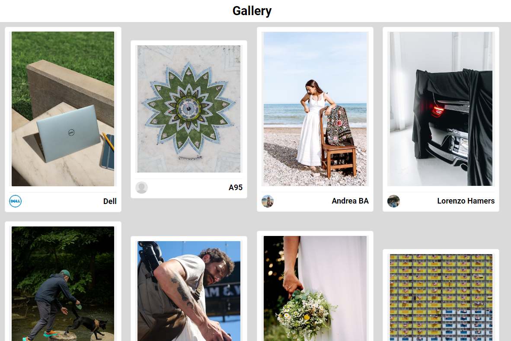

# Gallery Unsplash

## About

Implemented gallery based on React.JS that will display photos from unsplash.

[DEMO LINK](https://twoandmore.github.io/gallery-unsplash/)

## Preview



## How to work with. Steps:

1. Download or clone repository. `git clone git@github.com:TwoAndMore/gallery-unsplash.git`.
2. Open project folder with code editor (VS Code, WebStorm, other).
3. Run ```npm install``` in terminal.
4. Open second terminal and run ```npm start```.
5. If tab does not open, go to ```http://localhost:3000``` in your browser.
